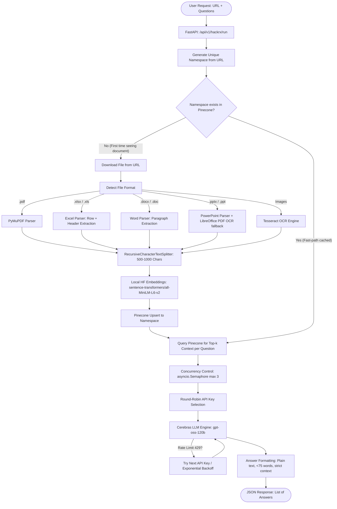

# 🧠 Project Explanation: High-Performance Multi-Format RAG Pipeline

This document provides a comprehensive, professional breakdown of your project. It explains **what** the project does, **how** it does it, and the **engineering rationale (why)** behind every architectural decision. You can use this as a study guide, an interview preparation document, or a presentation outline!

---

## 🚀 1. The Elevator Pitch (What is this project?)

This project is a **production-ready, high-performance Retrieval-Augmented Generation (RAG) API** built using **FastAPI**. It allows users to submit a URL to any document (PDF, Word, Excel, PowerPoint, Text, or Images) and a list of questions. 

The system automatically downloads the document, parses it (using OCR where necessary), extracts semantic text chunks, embeds and indexes them into a **Pinecone Vector Database**, and uses **Cerebras’ ultra-low-latency wafer-scale LLM engines** to answer the questions concurrently with strict context-adherence and automatic rate-limit rotation.

---

## 🛠️ 2. The Tech Stack

| Technology | Role in Project | Why We Used It |
| :--- | :--- | :--- |
| **FastAPI** | Web Framework & API Layer | Extremely fast (built on ASGI/Starlette), asynchronous, and automatically generates interactive OpenAPI documentation. |
| **Pinecone** | Vector Database | Serverless, highly scalable vector index optimized for fast similarity search across namespaces. |
| **Cerebras SDK** | Large Language Model (LLM) | Provides wafer-scale compute engine processing. Unmatched token generation speed, enabling near-instant answers. |
| **LangChain** | Text Splitting & Embedding Wrapper | Simplifies document chunking (`RecursiveCharacterTextSplitter`) and local embedding ingestion (`HuggingFaceEmbeddings`). |
| **Sentence-Transformers** | Text Embeddings | The `all-MiniLM-L6-v2` model runs locally to convert text chunks into high-quality 384-dimensional vector representations. |
| **PyMuPDF / pdfplumber** | PDF Parsing | Blazing fast text extraction and metadata retrieval from PDF files. |
| **OpenPyXL / docx / pptx** | Office Document Parsers | Native extraction of structured tables from Excel sheets, paragraphs from Word, and text shapes from PowerPoint. |
| **Tesseract OCR / pdf2image** | OCR Fallback Engine | Converts non-text assets (scanned PDFs, PowerPoint images, JPG/PNG files) into machine-readable text. |

---

## 🗺️ 3. System Architecture & Data Flow

Below is a diagram showing how data flows through your system when a user calls the `/api/v1/hackrx/run` endpoint:

---

## 💡 4. Deep Dive: Key Engineering Solutions & "Why" We Built Them

### A. Intelligent Namespace Generation & Caching (The Ingestion Skip)
* **What it is**: The system generates a clean, lowercase, alphanumeric namespace for each document URL (e.g., `https://example.com/financials_2025.pdf` becomes `financials_2025`).
* **Why it matters**: 
  * **Isolates Knowledge**: Different documents are stored in separate namespaces in Pinecone. This prevents "data bleeding"—questions about Document A will never accidentally retrieve chunks from Document B.
  * **Near-Instant Execution (Caching)**: Before downloading or embedding, the system asks Pinecone: *"Does this namespace already exist?"* If it does, the system **completely skips** the downloading, parsing, chunking, embedding, and uploading steps. It jumps straight to answering. This saves massive compute, local CPU/GPU cycles, and vector store costs.

### B. Robust Multi-Format Multimodal Ingestion Pipeline
* **What it is**: Your pipeline doesn't just read PDFs. It intelligently parses diverse formats:
  * **Structured Excel Data**: Instead of dumping cells as unstructured sentences, it identifies the header row (looking for fields like *Name*, *Mobile*, *Pincode*) and maps columns to structured key-value formats (`Header: Value`). This preserves tabular relationships.
  * **Intelligent PowerPoint Fallback**: It reads native slide shapes. If a slide is an image or lacks native text, it automatically converts it to a PDF using headless LibreOffice and runs Tesseract OCR slide-by-slide.
  * **Images & Scanned PDFs**: Uses Tesseract OCR to ensure scanned bills, images, or graphics are completely readable by the RAG model.

### C. Cerebras Wafer-Scale Compute & Low-Latency LLM Integration
* **What it is**: The system connects to **Cerebras Cloud SDK** to query `gpt-oss-120b`.
* **Why it matters**: Standard LLM APIs (like GPT-4 or Claude) can suffer from latency, especially when processing several RAG questions simultaneously. Cerebras utilizes wafer-scale engine hardware, delivering exceptionally low latency (extremely high tokens-per-second). This ensures the RAG application answers questions in milliseconds.

### D. Production-Grade API Key Round-Robin Rotation
* **What it is**: The project stores up to 3 Cerebras/Groq keys (`CEREBRAS_API_KEY`, `_1`, `_2`). For each inbound question, it rotates which key is used in a **round-robin** fashion.
* **Why it matters**: 
  * High-speed applications hit API rate-limits quickly (especially `429 Too Many Requests`).
  * By dividing the load across three rotating keys, you effectively triple your available rate limits and query capacity.

### E. Triple-Layer Resilience & Fallbacks
If rate limits *still* hit, the system has a nested resilience strategy:
1. **Fallback Keys**: If Key #1 hits a rate limit, it immediately tries Key #2 or #3.
2. **Exponential Backoff**: If *all* keys are fully exhausted, it uses an asynchronous sleep retry loop (`asyncio.sleep`) with backoff times (2 seconds, then 4s, then 8s) for up to 3 attempts.
3. **Reduced Concurrency (Semaphore)**: To prevent slamming the LLM and hitting rate limits in the first place, it restricts parallel processing to 3 questions at a time using an `asyncio.Semaphore(3)`.

---

## 📂 5. Codebase Directory Walkthrough

Here is a map of the file layout and what each file is responsible for:

### 1. `main.py`
The gateway to the application. It initializes the `FastAPI` instance and registers the router with the `/api/v1` prefix. It also provides a `/` health check route.

### 2. `api/routes.py`
Contains the API endpoints.
* **POST `/api/v1/hackrx/run`**: Takes a JSON body containing `documents` (the URL) and `questions` (list of strings).
* **Lazy Imports**: It imports `services.rag_service` *inside* the route handler. This ensures the app starts up immediately without waiting to load heavy libraries like PyTorch or HuggingFace on startup.

### 3. `config/settings.py`
Uses `python-dotenv` to load configurations from a `.env` file. It consolidates all environment variables (Pinecone keys, Cerebras/Groq keys, HF tokens) into a single object-oriented `settings` class and validates that required credentials exist.

### 4. `services/pdf_parser.py`
A simple helper service that downloads a PDF from a URL and extracts its raw text page-by-page using `pdfplumber`.

### 5. `services/hf_model.py`
Manages the LLM calling logic.
* Defines `ask_gpt(context, question)`.
* Contains the round-robin key rotation code.
* Implements rate-limit error detection and exponential backoff retry.
* **Strict Prompt Engineering**: Instructs the LLM to write replies under 75 words, format in plain text (no markdown, lists, or newlines), adhere strictly to the context even if it's silly/false, and reject unethical requests.

### 6. `services/vector_store.py`
Manages connections and transactions with Pinecone.
* Initializes the `sentence-transformers/all-MiniLM-L6-v2` embedding model from HuggingFace.
* **`embed_and_upsert`**: Breaks text down, creates embeddings, builds comprehensive metadata profiles (author, title, section, source, creation dates, page counts), and batch-uploads them.
* **`retrieve_from_kb`**: Embeds queries and fetches top-k similar matches, supporting advanced metadata filtering.

### 7. `services/rag_service.py`
The **orchestrator** that ties everything together.
* Performs namespace generation and checks if it exists in Pinecone.
* Houses the multi-format parsers (`extract_text_from_xlsx`, `extract_text_from_image`, `extract_text_from_pptx`, etc.).
* Implements `load_and_split_file` to route any extension to its matching loader.
* Coordinates parallel question execution using `asyncio.Semaphore`.

---

## 🏆 6. How to Talk About This Project (Interview / Presentation Tips)

If someone asks you: *"What is the most complex thing you built here?"* or *"What are you most proud of?"*, here are some excellent talking points:

1. **"I didn't just build a toy RAG; I built a resilient production pipeline."**
   * *Talk about key rotation & fallbacks*: "Many developers build RAG apps that crash when they hit LLM rate limits. I designed a custom round-robin key rotator across multiple API keys, supported by active fallback querying and exponential backoff retries. It makes the system incredibly resilient."
2. **"I solved the 'Contamination' problem using Vector Namespaces."**
   * *Explain namespacing*: "I didn't want answers for one document pulling context from another document. I wrote an automated namespace generator that extracts document identity from URLs and scopes the vector search strictly within that namespace."
3. **"I optimized cost and speed through Vector Caching."**
   * *Explain the bypass*: "Embedding models and vector databases are computationally expensive. I implemented a namespace check that caches existing documents. If a document has been analyzed once, the system answers new questions instantly without re-downloading or re-embedding anything."
4. **"I accommodated real-world enterprise documents, not just raw text."**
   * *Explain multi-format extraction*: "In the real world, documents are in Excel tables, slide presentations, and scanned image formats. I built custom parsing functions that maintain structured table layouts for Excel, and an OCR fallback flow for PowerPoint presentations utilizing LibreOffice."
